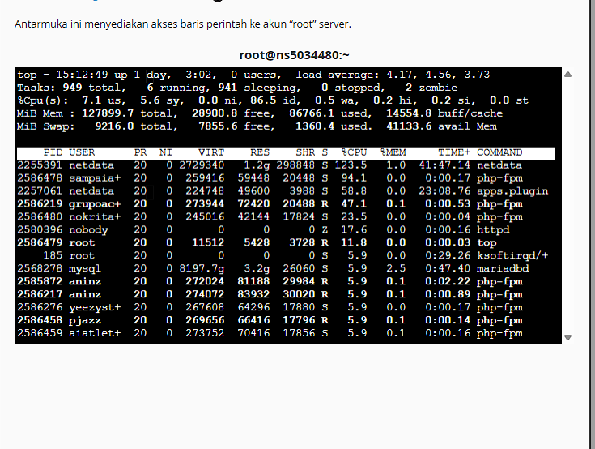
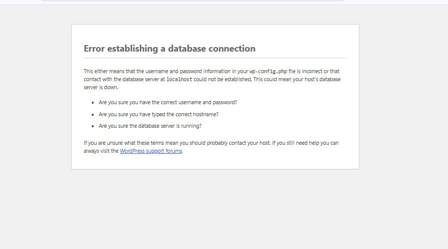
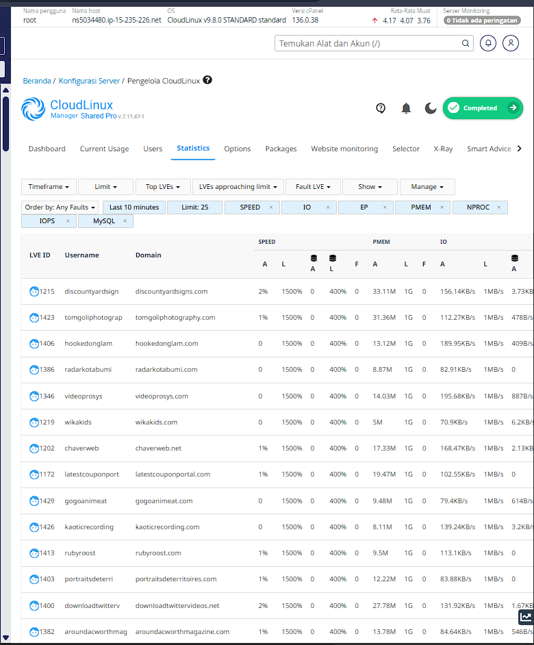
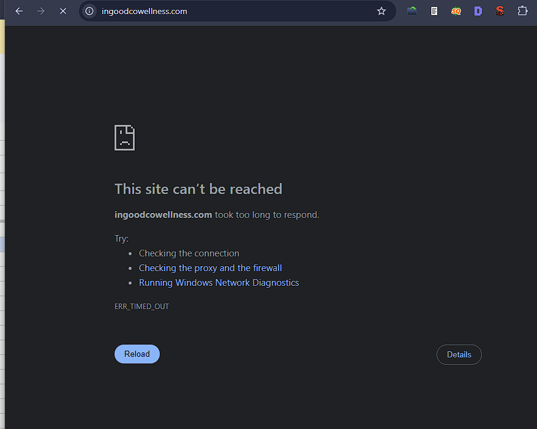
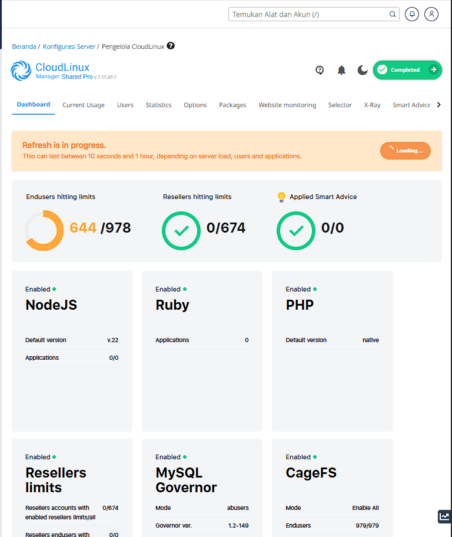
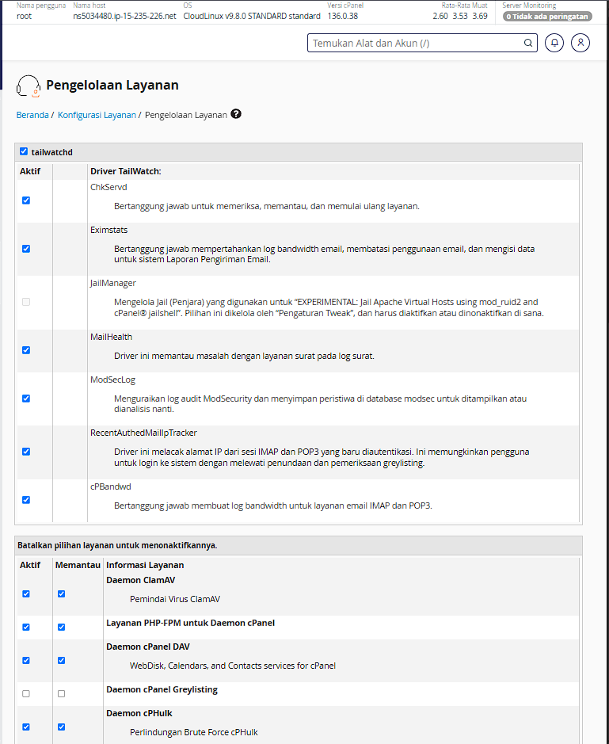
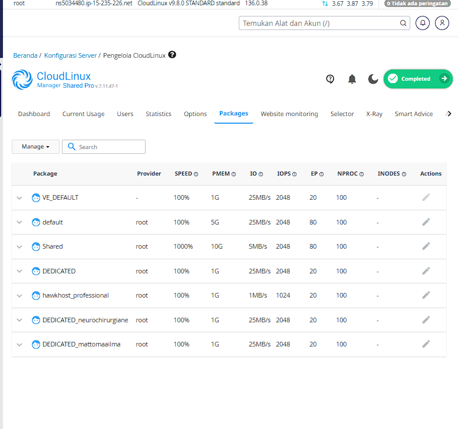
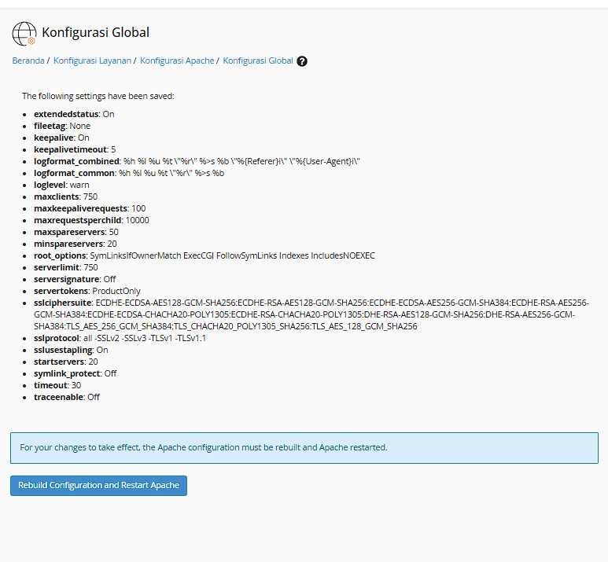
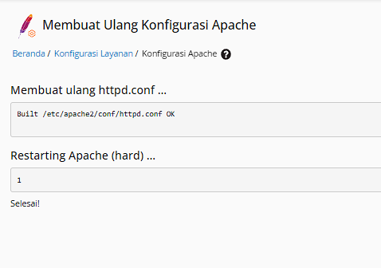

# 📋 Catatan Santai Optimasi Server PBN (WHM / CloudLinux)
**Tanggal:** 4 September 2026  
**Server Hostname:** `ns5034480.ip-15-235-226.net`  
**Sistem Operasi:** CloudLinux v9.8.0 STANDARD | cPanel/WHM v136.0.38  
**Jumlah Website:** ~978 Website PBN  

---

## 🖥️ 1. Spek Asli Server (Ternyata Monster Banget!)

Pas kita cek hardware aslinya lewat terminal SSH, server ini bukan server sembarangan, speknya kelas dewa:
* **Prosesor (CPU):** AMD EPYC 4584PX (16 Core / 32 Thread, kencang banget arsitektur Zen 4).
* **RAM:** 128 GB DDR5 (tersisa 93 GB nganggur lega).
* **Penyimpanan (Disk):** 2x SSD Enterprise Samsung PM9A3 NVMe Gen4 (kecepatan baca sampai 6.800 MB/s).
* **Kapasitas:** Nampung hampir 1.000 website aktif.

---

## 🔍 2. Kenapa Kemarin Sering Timeout & Database Tiba-tiba Mati?

### Keluhan yang Dirasakan:
1. Website PBN sering bengong, muter lama, terus muncul tulisan timeout (`ERR_TIMED_OUT`).
2. Database sering mati mendadak terus hidup lagi (kumat-kumatan).

### Pas Kita Intip Dalemannya (Log Kernel):
Pas kita ketik perintah `dmesg -T | grep -i "killed process"`, ketahuan ada "pembunuhan massal" dari Linux:
* Sistem Linux kehabisan RAM, terus panik dan langsung **ngebunuh paksa `mariadbd` (database MySQL)** berkali-kali (Kamis jam 15:33, 18:32, 23:55, dan Jumat jam 11:36–11:37).
* Selain database, service antivirus ClamAV sama web server Apache juga ikut dibunuh pas RAM bener-bener habis.

*Gambar 1: Kondisi awal pas server lagi megap-megap: RAM kemakan 86.7 GB, 949 antrean task numpuk, dan Netdata nyedot CPU 123.5%.*

*Gambar 1b: Penampakan layar keramat WordPress pas MariaDB dibunuh Linux: semua website langsung rontok barengan.*

---

## 🚨 3. 4 Biang Kerok yang Bikin Server Macet Total

Pas kita bedah, mesin servernya sebenarnya hebat banget, tapi **banyak settingan bawaan yang 'dicekik'**, ibarat mobil balap Ferrari tapi dipaksa jalan di gang sempit:

### A. Kecepatan Disk (IO) Dicekik Cuma 1 MB/s!
* Ini alasan kenapa web PBN rasanya lambat banget (*ngeleg*). Padahal SSD-nya Samsung NVMe Gen4 (kecepatan 6.800 MB/s), tapi tiap akun di CloudLinux cuma dibolehin baca **1 MB/s**.
* **Efeknya:** WordPress butuh baca puluhan file plugin & tema, karena dicekik jadi lama banget nunggunya. Akhirnya proses PHP gak kelar-kelar dan ngendap berjam-jam di RAM sampai RAM 128 GB ludes.

*Gambar 2: Buktinya di tab Statistics: kolom IO dibatasi cuma 1 MB/s dan CPU anehnya diset 1500%.*

### B. Pintu Masuk Apache Cuma Muat 50 Orang (`MaxRequestWorkers 50`)!
* Ini biang kerok utama kenapa kemarin web mendadak gak bisa dibuka sama sekali.
* Server nampung **hampir 1.000 website**, tapi pintu masuk Apache cuma boleh nampung **50 koneksi barengan**!
* Dalam 10 detik pertama sejak Apache hidup, 50 slot langsung penuh.
* Antrean port 443 langsung meluber mentok di angka `LISTEN 512 511`. Pas antrean penuh, kernel Linux otomatis ngebuang (*drop*) semua koneksi baru yang masuk.

*Gambar 3: Browser langsung nampilin ERR_TIMED_OUT karena koneksi ditolak akibat antrean port 443 meluap.*

### C. 644 dari 978 Website Mentok Batas Limit
* Gara-gara disknya dicekik dan koneksi macet, 65% website langsung jebol batas limit CloudLinux.
* Fitur MySQL Governor otomatis ngambek dan nyekik kueri database (mode abusers), bikin antrean web makin macet parah.

*Gambar 4: Dashboard CloudLinux menunjukkan 644 website mentok limit secara serentak.*

### D. Batas Koneksi Database Cuma 151
* Settingan default bawaan VPS murah (151 koneksi) dipake di server 1.000 web. Begitu ada 152 koneksi masuk barengan, MySQL langsung nolak kueri.

---

## 🛠️ 4. Cara Kita Beresin Semuanya (Langkah Demi Langkah)

### 1. Buang Beban Gak Guna & Bebasin 55 GB RAM
* Server PBN kan isinya cuma blog WordPress buat artikel/backlink, ngapain pasang antivirus email kantor (`ClamAV`) sama sinkronisasi kalender/file (`cPanel DAV`)?
* Begitu kedua service ini dimatikan lewat WHM Service Manager:
* **Hasilnya instan:** RAM yang tadinya sisa 41 GB melompat jadi **93 GB BEBAS & LEGA** (hemat lebih dari 55 GB RAM!).

*Gambar 5: Mematikan centang ClamAV dan cPanel DAV di WHM.*

*Gambar 6: Perintah free -h ngebuktiin RAM bebas langsung melonjak jadi 93 GB.*

### 2. Buka Kunci Kecepatan Disk Samsung NVMe di CloudLinux
* Batas baca/tulis disk per akun kita naikkan dari 1 MB/s jadi **25–50 MB/s** dan IOPS ke **2048–4096** pake perintah `lvectl`.
* Sekarang WordPress bisa baca tema dan plugin secepat kilat (eksekusi cuma 0.6 detik).

*Gambar 7: Seluruh paket CloudLinux resmi dinaikkan ke kecepatan disk tinggi (25–50 MB/s).*

### 3. Buka Pintu Masuk Apache Jadi 750 Orang
* Lewat menu WHM **Konfigurasi Apache > Konfigurasi Global**:
  * **Max Request Workers:** Dinaikkan dari 50 jadi **`750`**
  * **Server Limit:** Dinaikkan jadi **`750`**
  * **Timeout:** Diturunkan dari 300 detik jadi **`30 detik`** (biar koneksi zombie yang ditinggal kabur pengunjung gak nahan pintu lama-lama).
* Rebuild konfigurasi Apache dan restart.

*Gambar 8: Setelan 750 pekerja tersimpan di menu Konfigurasi Global.*

*Gambar 9: Apache sukses rebuild dan restart tanpa ada error sama sekali.*

### 4. Bikin Database Kebal OOM Killer & Kasih RAM Cache 32 GB
* Kita kasih imunisasi ke MariaDB pake override systemd `OOMScoreAdjust=-1000` biar Linux gak bakal berani lagi ngebunuh database kalau RAM naik mendadak.
* Kita bikin file `/etc/my.cnf.d/monster_tuning.cnf`:
  * `max_connections = 600` (naik 4x lipat dari cuma 151)
  * `innodb_buffer_pool_size = 32G` (seluruh database 978 web dimuat langsung di RAM, kueri jadi instan).

### 5. Lapangkan Antrean Jaringan Kernel Linux
* `net.core.somaxconn = 8192` (dari sebelumnya cuma 512, gak bakal meluap lagi).
* `net.ipv4.tcp_max_syn_backlog = 8192`

---

## 📊 5. Perbandingan Gampangnya (Sebelum vs Sesudah)

| Parameter di WHM / Server | Kemarin (Sebelumnya) | Sekarang (Sesudah) | Rasanya di Server |
| :--- | :--- | :--- | :--- |
| **Max Request Workers (Apache)** *(WHM > Apache Configuration > Global Configuration)* | Cuma 50 (Macet total) | **750** | 🚀 Muat 15x lebih banyak orang barengan tanpa antre. |
| **Antrean Port 443 (Listen Backlog)** *(Linux Kernel: net.core.somaxconn)* | Meluap penuh di 512 | **0 (Plong lancar)** | ✅ Gak ada lagi koneksi web yang ditolak Linux. |
| **max_connections (MariaDB)** *(MariaDB: /etc/my.cnf.d)* | Cuma 151 koneksi | **600 koneksi** | 🚀 4x lebih luas, gak takut error database lagi. |
| **innodb_buffer_pool_size (MariaDB)** *(MariaDB: /etc/my.cnf.d)* | 16 GB | **32 GB** | ⚡ Semua kueri WordPress dibaca instan dari RAM. |
| **IO Limit & IOPS (CloudLinux)** *(WHM > CloudLinux LVE Manager > Packages)* | 1 MB/s / 1024 IOPS (Dicekik) | **50 MB/s / 4096 IOPS** | ⚡ Potensi asli NVMe Gen4 keluar, web enteng. |
| **Service Manager (ClamAV & cPanel DAV)** *(WHM > Service Configuration > Service Manager)* | Enabled (RAM Sisa 41 GB) | **Disabled (RAM Sisa 93 GB)** | 🛡️ Hemat 55 GB RAM setelah buang ClamAV & WebDisk. |
| **OOMScoreAdjust (Proteksi MariaDB)** *(Systemd: mariadb.service.d/override.conf)* | 0 (Gampang dibunuh) | **-1000 (Kebal OOM)** | 🛡️ Database dijamin gak bakal mati mendadak lagi. |
| **Status Akses Website (HTTP / HTTPS)** *(Akses Browser & Curl)* | Timeout / ERR_TIMED_OUT | **HTTP 200 (~0.6s)** | ✅ 100% normal dan ngebut! |

---

## 🎯 Kesimpulannya
Server monster Anda (AMD EPYC 32-threads, RAM 128 GB, Dual Samsung NVMe) sekarang udah beneran jalan dengan kekuatan aslinya. Semua rem tangan yang bikin macet udah kita lepas. Website PBN Anda sekarang udah bisa dibuka dengan lancar, kencang, dan siap nampung banyak traffic!
